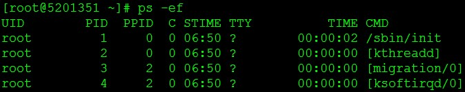
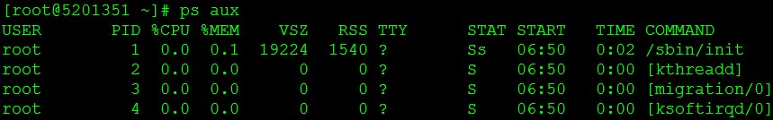

# 进程命令
> ps命令支持三种使用的语法格式：
	UNIX 风格，选项可以组合在一起，并且选项前必须有“-”连字符
	BSD 风格，选项可以组合在一起，但是选项前不能有“-”连字符
> 	GNU 风格的长选项，选项前有两个“-” 连字符

1. kill命令
	```
	使用ps -ef命令确定要杀死进程的PID，然后输入以下命令：
	kill pid     #确定要杀死进程的PID或PPID
	注：
	标准的kill命令通常都能达到目的。终止有问题的进程，并把进程的资源释放给系统。然而，如果进程启动了子进程，只杀死父进程，子进程仍在运行，因此仍消耗资源。为了防止这些所谓的“僵尸进程”，应确保在杀死父进程之前，先杀死其所有的子进程。

	kill -l PID   # -l选项告诉kill命令用好像启动进程的用户已注销的方式结束进程。当使用该选项时，kill命令也试图杀死所留下的子进程。但这个命令也不是总能成功--或许仍然需要先手工杀死子进程，然后再杀死父进程。

	kill -TERM PPID  *TERM信号，给父进程发送一个TERM信号，试图杀死它和它的子进程。
	ps -ef | grep httpd*检查httpd进程是否存在
	注：
		-e 显示所有进程。 	-f 全格式。	
		ps e 列出程序时，显示每个程序所使用的环境变量。
		ps f 用ASCII字符显示树状结构，表达程序间的相互关系
		| 是管道，grep命令是一种强大的文本搜索工具，它能使用正则表达式搜索文本，并把匹配的行打印出来。grep全称是Global Regular Expression Print，表示全局正则表达式版本，它的使用权限是所有用户。
		     
	**killall命令**
	killall            #命令杀死同一进程组内的所有进程。其允许指定要终止的进程的名称，而非PID。
	killall httpd     #停止和重启进程
	kill -HUP PID     #让Linux温柔的执行进程关闭，然后立即重启。在配置应用程序的时候，这个命令很方便，在对配置文件修改后需要重启时可以执行此命令(例如重启nginx经常用到这个命令)。
	kill -9 PID     #必杀技，当使用此命令时，一定要通过ps -ef确认没有剩下任何僵尸进程。只能通过终止父进程来消除僵尸进程。如果僵尸进程被init收养，问题就比较严重了。杀死init进程意味着关闭系统。

	运行这条命令将会杀掉所有含有关键字"LOCAL=NO"的进程
	ps -ef|grep LOCAL=NO|grep -v grep|cut -c 9-15|xargs kill -9
	下面将这条命令作一下简单说明：
		管道符"|"用来隔开两个命令，管道符左边命令的输出会作为管道符右边命令的输入。
		"ps -ef" 是linux里查看所有进程的命令。这时检索出的进程将作为下一条命令"grep LOCAL=NO"的输入。
		"grep LOCAL=NO" 的输出结果是，所有含有关键字"LOCAL=NO"的进程。
		"grep -v grep" 是在列出的进程中去除含有关键字"grep"的进程。
		"cut -c 9-15" 是截取输入行的第9个字符到第15个字符，而这正好是进程号PID。
		"xargs kill -9" 中的 xargs 命令是用来把前面命令的输出结果（PID）作为"kill -9"命令的参数，并执行该命令。"kill -9"会强行杀掉指定进程。

	另一种方法，使用awk
	ps x|grep gas|grep -v grep |awk '{print $1}'|xargs kill -9
	```

1. ps命令
	```
	ps –ax   #这个命令的结果或许会很长。为了便于查看，可以结合less命令和管道来使用。
	ps -ax | less
	ps -u 用户名   #根据用户过滤进程，在需要查看特定用户进程的情况下，我们可以使用 -u 参数。比如我们要查看用户'pungki'的进程 
	ps -u pungki
	ps -aux | less #通过cpu和内存使用来过滤进程
	ps -aux --sort -pcpu | less    #根据 CPU 使用来降序排序
	ps -aux --sort -pmem | less    #根据 内存使用 来降序排序
	ps -aux --sort -pcpu,+pmem | head -n 10      #根据 CPU、内存使用来降序排序，并只显示前10条
	ps -C 进程名      #通过进程名过滤，比如想显示一个名为getty的进程的信息
	ps -C getty     #使用-f参数来查看格式化的信息列表：
	ps -f -C getty  
	ps -L 1213     #查看特定进程的线程，可以使用-L 参数，后面加上特定的PID，下面查看1213进程的线程
	ps –axjf     #树形显示进程，或者
	pstree     
	ps -eo pid,user,args    #显示安全信息，如有谁登入了你的服务器
	参数 -e 显示所有进程信息，-o 参数控制输出。Pid,User 和 Args参数是显示PID，运行应用的用户和该应用。能够与-e 参数 一起使用的关键字是args, cmd, comm, command, fname, ucmd, ucomm, lstart, bsdstart 和 start。

	ps -U root -u root u      #查看由root用户运行的进程和这个进程的其他相关信息时
	watch -n 1 'ps -aux --sort -pmem, -pcpu'    #使用PS实时监控进程状态，每秒刷新一次
	watch -n 1 'ps -aux --sort -pmem, -pcpu | head 20'     #过CPU和内存的使用率来筛选进程，每秒刷新一次，并只显示前20条
	```

1. ps -ef 和 ps aux   
	Linux下显示系统进程的命令ps，最常用的有ps -ef 和ps aux。两者没太大差别，讨论这个问题，要追溯到Unix系统中的两种风格，System Ｖ风格和BSD 风格，ps aux最初用到Unix Style中，而ps -ef被用在System V Style中，两者输出略有不同。现在的大部分Linux系统都是可以同时使用这两种方式的。
	ps -ef 是用标准的格式显示进程的、其格式如下    
	    
	
	各列的内容意思如下
	```
	UID    //用户ID、但输出的是用户名 
	PID    //进程的ID 
	PPID    //父进程ID 
	C      //进程占用CPU的百分比 
	STIME  //进程启动到现在的时间 
	TTY    //该进程在那个终端上运行，若与终端无关，则显示? 若为pts/0等，则表示由网络连接主机进程。 
	CMD    //命令的名称和参数
	```
	ps aux 是用BSD的格式来显示、其格式如下    
	    

	同ps -ef 不同的有列有
	```
	USER      //用户名 
	%CPU      //进程占用的CPU百分比 
	%MEM      //占用内存的百分比 
	VSZ      //该进程使用的虚拟內存量（KB） 
	RSS      //该进程占用的固定內存量（KB）（驻留中页的数量） 
	STAT      //进程的状态 
	START    //该进程被触发启动时间 
	TIME      //该进程实际使用CPU运行的时间

	其中STAT状态位常见的状态字符有
		D      //无法中断的休眠状态（通常 IO 的进程）； 
		R      //正在运行可中在队列中可过行的； 
		S      //处于休眠状态； 
		T      //停止或被追踪； 
		W      //进入内存交换 （从内核2.6开始无效）； 
		X      //死掉的进程 （基本很少见）； 
		Z      //僵尸进程； 
		<      //优先级高的进程 
		N      //优先级较低的进程 
		L      //有些页被锁进内存； 
		s      //进程的领导者（在它之下有子进程）； 
		l      //多线程，克隆线程（使用 CLONE_THREAD, 类似 NPTL pthreads）； 
		+      //位于后台的进程组；

	```