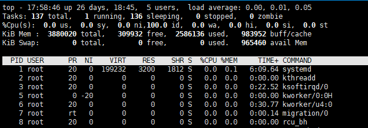
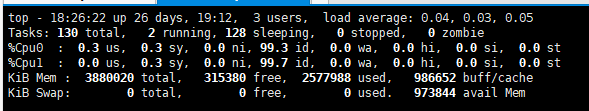
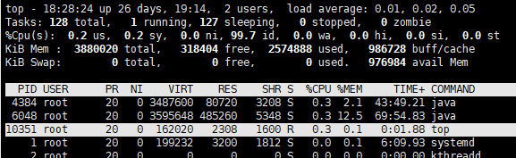
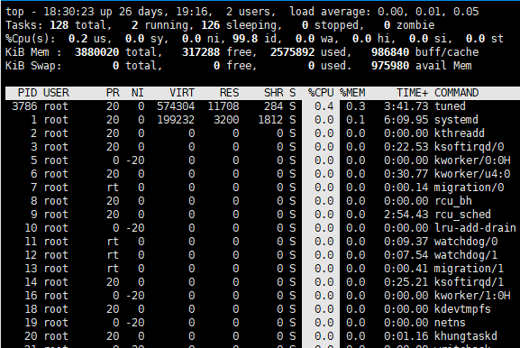
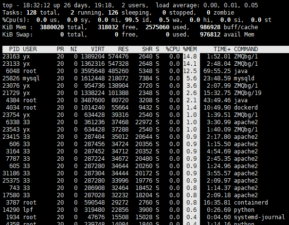

# Top 

top命令是Linux下常用的性能分析工具，能够实时显示系统中各个进程的资源占用状况，类似于Windows的任务管理器

## 看指标



#### 第一行 任务队列信息，同 uptime 命令的执行结果

系统时间：17:58:46

运行时间：up 26 dasy 18h  45min

当前登录用户：  5 user

负载均衡(uptime)  load average: 0.00, 0.01, 0.05
```
average后面的三个数分别是1分钟、5分钟、15分钟的负载情况。
```
load average数据是每隔5秒钟检查一次活跃的进程数，然后按特定算法计算出的数值。如果这个数除以逻辑CPU的数量，结果高于5的时候就表明系统在超负荷运转了

#### 第二行 Tasks — 任务（进程）

总进程:137 total, 运行:1 running, 休眠:136 sleeping, 停止: 0stopped, 僵尸进程: 0 zombie

#### 第三行 cpu状态信息

0.0%us【user space】— 用户空间占用CPU的百分比。

0.0%sy【sysctl】— 内核空间占用CPU的百分比。

0.0%ni【】— 改变过优先级的进程占用CPU的百分比

100.0%id【idolt】— 空闲CPU百分比

0.0%wa【wait】— IO等待占用CPU的百分比

0.0%hi【Hardware IRQ】— 硬中断占用CPU的百分比

0.0%si【Software Interrupts】— 软中断占用CPU的百分比

#### 第四行 内存状态

3880020 total,   309932 free,  258616 used,   983952 buff/cache 【缓存的内存量】

#### 第五行 swap交换分区信息

0 total,        0 free,        0 used.   965460 avail Mem【缓冲的交换区总量】

备注：

可用内存=free + buffer + cached

对于内存监控，在top里我们要时刻监控第五行swap交换分区的used，如果这个数值在不断的变化，说明内核在不断进行内存和swap的数据交换，这是真正的内存不够用了。

第四行中使用中的内存总量（used）指的是现在系统内核控制的内存数，

第四行中空闲内存总量（free）是内核还未纳入其管控范围的数量。

纳入内核管理的内存不见得都在使用中，还包括过去使用过的现在可以被重复利用的内存，内核并不把这些可被重新使用的内存交还到free中去，因此在linux上free内存会越来越少，但不用为此担心。

#### 第六行 空行

#### 第七行以下：各进程（任务）的状态监控

```
PID — 进程id
USER — 进程所有者
PR — 进程优先级
NI — nice值。负值表示高优先级，正值表示低优先级
VIRT — 进程使用的虚拟内存总量，单位kb。VIRT=SWAP+RES
RES — 进程使用的、未被换出的物理内存大小，单位kb。RES=CODE+DATA
SHR — 共享内存大小，单位kb
S —进程状态。D=不可中断的睡眠状态 R=运行 S=睡眠 T=跟踪/停止 Z=僵尸进程
%CPU — 上次更新到现在的CPU时间占用百分比
%MEM — 进程使用的物理内存百分比
TIME+ — 进程使用的CPU时间总计，单位1/100秒
COMMAND — 进程名称（命令名/命令行）
```

## 其他使用技巧
#### 1.多核CPU监控

在top基本视图中，按键盘数字“1”，可监控每个逻辑CPU的状况：逻辑上有2个，实际中只有1个。



#### 2.高亮显示当前运行进程

敲击键盘“b”（打开/关闭加亮效果），top的视图变化如下：




我们发现 “top” 进程被加亮了，top进程就是视图第二行显示的唯一的运行态（runing）的那个进程，可以通过敲击“y”键关闭或打开运行态进程的加亮效果。

#### 3.进程字段排序

默认进入top时，各进程是按照CPU的占用量来排序的，敲击键盘“x”（打开/关闭排序列的加亮效果）



#### 4.通过 `shift + >` 或 `shift + <`  可以向右或左改变排序列

按一次 `shift + >` 的效果图,视图现在已经按照%MEM来排序，再按一次按时间排



#### 5.top交互命令

```
h 显示帮助画面，给出一些简短的命令总结说明
k 终止一个进程。
i 忽略闲置和僵死进程。这是一个开关式命令。
q 退出程序
r 重新安排一个进程的优先级别
S 切换到累计模式
s 改变两次刷新之间的延迟时间（单位为s)
f或者F 从当前显示中添加或者删除项目
o或者O 改变显示项目的顺序
l 切换显示平均负载和启动时间信息
m 切换显示内存信息
t 切换显示进程和CPU状态信息
c 切换显示命令名称和完整命令行
M 根据驻留内存大小进行排序
P 根据CPU使用百分比大小进行排序
T 根据时间/累计时间进行排序
W 将当前设置写入~/.toprc文件中
```

#### 6. 常用命令显示

显示完整命令
```
top -c
```

设置信息更新次数
```
top -n 2  #表示更新两次后终止更新显示
```

设置信息更新时间
```
top -d 3 #表示更新周期为3秒
```