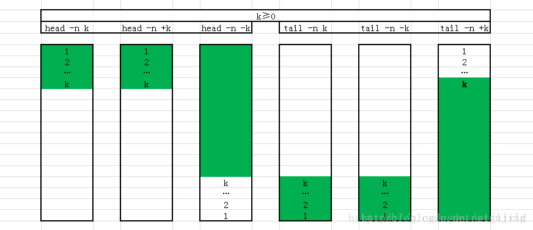

查找日志的技巧

## 关键字搜索日志
#####  使用 less 命令
1. less 命令
  ```
  less catalina.out
  ```

  带出行号查看文件:日志文件一般有上万行，带行号显示会方便很多

  ```
  less -N catalina.out
  ```

1. 基本用法
  ```
  j    下一行
  k    上一行
  f    向下滚动一屏幕（forward）
  b    向上滚动一屏幕(back)
  g    定位到文档头部
  G    定位到文档最尾部 
  空格  向下滚动一屏幕
  键盘上键    下一行
  键盘下键   上一行  
  q    退出less模式
  ```

2. 查找内容
  ```
  /keyword　　向下查找
  ?keyword　　向上查找
  n(小写字母n)   向上匹配下一处匹配文本
  N(大写字母N)    向下匹配下一处匹配文本
  ```


3. 实时查看文档变动（实时滚动文档）
  ```
  Ctrl + c　　退出实时滚动模式,进入交互模式
  F    　　　　实时滚动文档
  ```

  类似效果

  ```
  tail -f catalina.out
  ```

## 查找某个时间段的日志
比如查询 2018-08-15 10:37:32到2018-08-15 10:38:01这是时间段的日志

命令： `sed -n '/starttime/,/endtaime/p' catalina.out`
```
sed  -n  '/2018-08-15 10:37:32/,/2018-08-15 10:38:01/p'  catalina.out
```

> 注意：这里的starttime和endtime都必须是日志文件中存在的

如何判定他们存在呢?
```
grep '2018-08-15 10:37:32' catalina.out
```

## 查看指定行的内容

##### head
```
head -n 3 testfile  #从头数，数3行
head -n +3 testfile  #从头数,数3行，同上
head -n -3 testfile   #从头数,数到尾部3行，-3的意义是除了最后k行的所有行
```


##### tail

```
tail -n 3  testfile  #从尾数3行
tail -n -3 testfile  #从尾数3行
tail -n +3 testfile  #输出从3行开始所有行
```



## 搜索文件中的某个关键字
方法1： `cat 路径/文件名 | grep 关键词`

```
cat  test.log | grep "http"　　# 返回test.log中包含http的所有行
```

方法2： `grep -i 关键词 路径/文件名` 

```
grep -i "http" test.log　　# 返回test.log中包含http的所有行
```
