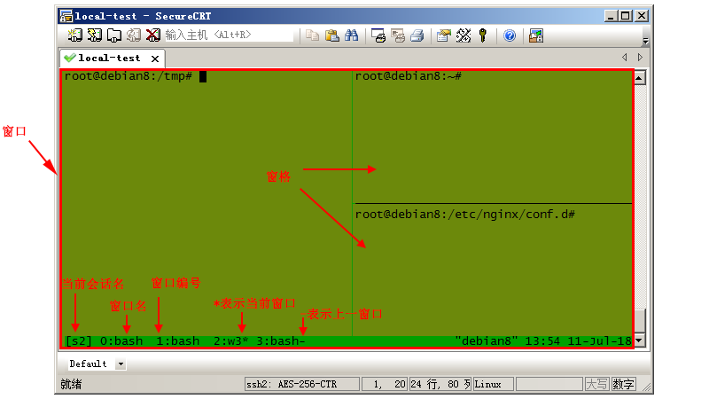

# Tmux 终端复用


## tmux是什么
tmux（terminal multiplexer）是Linux上的终端复用神器，可从一个屏幕上管理多个终端（准确说是伪终端）。使用该工具，用户可以连接或断开会话，而保持终端在后台运行。类似的工具还有screen，个人对这二者的使用感受是，用过tmux就再也不想用screen了。

## tmux基本结构
tmux的结构包括会话(session)、窗口(window)、窗格(pane)三部分，会话实质是伪终端的集合，每个窗格表示一个伪终端，多个窗格展现在一个屏幕上，这一屏幕就叫窗口。基本结构及状态信息如下图所示：



## tmux基本操作

基本的操作无非就是对会话、窗口、窗格进行管理，包括创建、关闭、重命名、连接、分离、选择等等。

一般使用命令和快捷键进行操作，可在系统shell终端和tmux命令模式（类似vim的命令模式）下使用命令，或者在tmux终端使用快捷键。

tmux默认的快捷键前缀是Ctrl+b(下文用prefix指代)，按下前缀组合键后松开，再按下命令键进行快捷操作，比如使用prefix d分离会话（应该写作prefix d而不是prefix+d，因为d键不需要与prefix同时按下）。

快捷键可以自定义，比如将前缀改为Ctrl+a，但需要保留shell默认的Ctrl+a快捷键，按如下所示修改~/.tmux.conf文件：

```
set-option -g prefix C-a
2unbind-key C-b
bind-key C-a send-prefix
bind-key R source-file ~/.tmux.conf \; display-message "~/.tmux.conf reloaded."
```
现在已将原先的Ctrl+a用prefix Ctrl+a取代，即需要按两次Ctrl+a生效。

第4行的作用是使用prefix r重新加载配置文件，并输出提示，否则需要关闭会话后配置文件才能生效，也可手动加载配置文件，在tmux终端输入"prefix :"进入命令模式，用source-file命令加载配置文件。

注意，将多个命令写在一起作为命令序列时，命令之间要用空格和分号分隔。 
　

## 常用命令

### 会话管理(用的最多)

```
tmux new　　#创建默认名称的会话（在tmux命令模式使用new命令可实现同样的功能，其他命令同理，后文不再列出tmux终端命令）

tmux new -s mysession　　#创建名为mysession的会话

tmux ls　　#显示会话列表

tmux a　　#连接上一个会话

tmux a -t mysession　　#连接指定会话

tmux rename -t s1 s2　　#重命名会话s1为s2

tmux kill-session　　#关闭上次打开的会话

tmux kill-session -t s1　　#关闭会话s1

tmux kill-session -a -t s1　　#关闭除s1外的所有会话

tmux kill-server　　#关闭所有会话
```

### 常用快捷键

```
prefix s　　#列出会话，可进行切换

prefix $　　#重命名会话

prefix d　　#分离当前会话

prefix D　　#分离指定会话
```

　　

### 窗口管理
```
prefix c　　#创建一个新窗口

prefix ,　　#重命名当前窗口

prefix w　　#列出所有窗口，可进行切换

prefix n　　#进入下一个窗口

prefix p　　#进入上一个窗口

prefix l　　#进入之前操作的窗口

prefix 0~9　　#选择编号0~9对应的窗口

prefix .　　#修改当前窗口索引编号

prefix '　　#切换至指定编号（可大于9）的窗口

prefix f　　#根据显示的内容搜索窗格

prefix &　　#关闭当前窗口
```
　

### 窗格管理
```
prefix %　　#水平方向创建窗格

prefix "　　#垂直方向创建窗格

prefix Up|Down|Left|Right　　#根据箭头方向切换窗格

prefix q　　#显示窗格编号

prefix o　　#顺时针切换窗格

prefix }　　#与下一个窗格交换位置

prefix {　　#与上一个窗格交换位置

prefix x　　#关闭当前窗格

prefix space(空格键)　　#重新排列当前窗口下的所有窗格

prefix !　　#将当前窗格置于新窗口

prefix Ctrl+o　　#逆时针旋转当前窗口的窗格

prefix t　　#在当前窗格显示时间

prefix z　　#放大当前窗格(再次按下将还原)

prefix i　　#显示当前窗格信息
```

### 其他命令
```
tmux list-key　　#列出所有绑定的键，等同于prefix ?

tmux list-command　　#列出所有命令
```


# 参考
1. tmux基本操作 . https://www.cnblogs.com/liuguanglin/p/9290345.html
